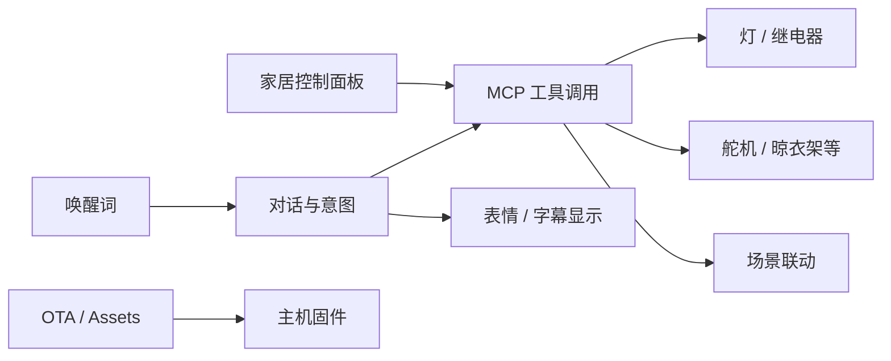

# xiaozhi_p4

基于 **小智 AI** 框架的 **ESP32-P4** 语音主机工程：大模型语音交互 + MCP 设备控制 + LVGL 智能家居面板，并配套楼层从机（分布式 IoT）。

上游小智通用说明见 `README_zh.md`；本 README 描述**本仓库落地形态**（P4 板级、家居面板、从机）。

## 系统架构图

```mermaid
flowchart TB
  USER[用户语音 / 触控屏]
  USER --> HOST

  subgraph HOST["主机 ESP32-P4 Function-EV-Board"]
    SR[离线唤醒 ESP-SR]
    LLM[流式 ASR + LLM + TTS]
    MCP[MCP Server\n设备/家居工具]
    UI[LVGL Shell\n小智聊天 | 智能家居面板]
    DISP[MIPI LCD 1024x600 + 触摸]
    NET[Wi-Fi Remote / ESP-Hosted]
    SR --> LLM --> MCP
    LLM --> UI --> DISP
    MCP --> UI
    NET --> LLM
  end

  subgraph SLAVES["slave/ 楼层从机"]
    F1[xiaozhi_slave_Firstfloor]
    F2[xiaozhi_slave_Secondfloor]
    F3[xiaozhi_slave_Thirdfloor]
  end

  MCP -->|ESP-NOW / IoT 指令| F1 & F2 & F3
  F1 & F2 & F3 -->|状态/心跳| MCP
```

## 功能框图



## 仓库结构

| 路径 | 说明 |
|------|------|
| `main/` | 小智主程序：application、音频、显示、mcp_server、smart_home、boards |
| `slave/` | 一/二/三楼从机工程 |
| `partitions/` | v2 分区表（与 v1 OTA 不兼容） |
| `docs/` / `READ_DOC.md` | P4 + LVGL 家居面板融合评估 |
| `sdkconfig.defaults.esp32p4` | P4 默认配置 |
| `README_zh.md` | 上游小智功能与硬件列表 |

## 构建提示

- 目标芯片：`esp32p4`
- 构建产物：仓库根 `build/`，镜像 `build/xiaozhi.bin`（见 `AGENTS.md`）

```bat
idf.py set-target esp32p4
idf.py build
```

## 远程

```text
origin → https://github.com/linxi27667/xiaozhi_p4.git
```

本地常见路径：`E:\MCU\esp32\p4\xiaozhi-for-p4`
